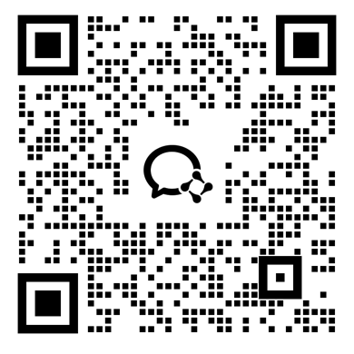

# Hi, I'm Katerina 👋

<strong>中文</strong>

文科出身，做了 9 年产品经理，现在做 AI Agent 算法工程师。

我用 Coding Agents 做产品、自动化工具和自己的 Skills。对我来说，AI 是把审美、想法和判断力做成真实产品的一种方式。

<strong>English</strong>

I came from the humanities, spent 9 years as a product manager, and now work my way into AI algorithm engineering.

I build products, automation tools, and custom Skills with Coding Agents. For me, AI is a way to turn taste, ideas, and judgment into things that actually run.

---

## AI Builder Community

「可梦 AI 超级个体社区」是我搭建的社区。

在社区中，我会持续分享 AI 玩法邪修攻略和 OPC 极速变现思路。

你可以看到由我本人亲手筛选过的 AI 新闻、一手信息、各个 AI 大厂的优质活动，以及便宜低价的 tokens。

我是个很讨厌浪费时间的人，希望我的筛选能帮你节约一点时间。

这里不欢迎站在岸上夸夸其谈的演说家，只欢迎亲手把 AI idea 做出来的人。

  

  

